# 💬 CP2 Chat — Chat individual e em grupo com Firebase e Push Notifications

Aplicativo de chat em **React Native + TypeScript (Expo)** com **Firebase** como backend: conversas individuais e em
grupo entre usuários autenticados por **e-mail e senha**, mensagens em tempo real, grupos com **limite configurável de
integrantes** (protegido contra concorrência) e **notificações push** calculadas por uma **API própria publicada na
internet**, de acordo com uma política configurável por grupo.

## 👥 Integrantes

- RM557768 — Léo Masago
- RM556807 — Eduardo Tomazela
- RM555235 — Luiz Henrique Silva

---

## 📑 Sumário

1. [Tecnologias e versões](#-tecnologias-e-versões)
2. [Arquitetura e responsabilidade de cada serviço](#-arquitetura-e-responsabilidade-de-cada-serviço)
3. [Estrutura do projeto](#-estrutura-do-projeto)
4. [Instalação e execução (passo a passo)](#-instalação-e-execução-passo-a-passo)
5. [Configuração do Firebase](#1-configuração-do-firebase)
6. [Armazenamento das fotos](#-armazenamento-das-fotos)
7. [Notificações push no Android e no iOS](#-notificações-push-no-android-e-no-ios)
8. [API de notificações](#-api-de-notificações)
9. [Política de notificações](#-política-de-notificações)
10. [Limite de integrantes e concorrência](#-limite-de-integrantes-e-proteção-contra-concorrência)
11. [Regras de segurança](#-regras-de-segurança)
12. [Testes](#-testes)
13. [Desenvolvimento com emuladores](#-desenvolvimento-com-emuladores-opcional)
14. [Prints das telas e evidência de notificação](#-prints-das-telas)
15. [Decisões de projeto e limitações](#-decisões-de-projeto-e-limitações)

---

## 🧰 Tecnologias e versões

| Camada | Tecnologia |
|---|---|
| App | **Expo SDK 55** (`expo ~55.0.31`), React Native 0.83, React 19.2, **TypeScript 5.9** (modo `strict`, **sem `any`**) |
| Navegação | React Navigation 7 (`native-stack`) com parâmetros tipados (`src/types/navigation.ts`) |
| Backend (cliente) | Firebase JS SDK 12: Authentication, Cloud Firestore, Realtime Database, Storage |
| Push | `expo-notifications` + **Firebase Cloud Messaging** (Android) / Expo Push Service → APNs (iOS) |
| Build | Development build com `expo-dev-client` + EAS Build (o push **não** depende do Expo Go) |
| API de push | **Node.js 20+ / Express 5 / TypeScript**, Firebase Admin SDK, `expo-server-sdk`, Zod, Helmet |
| Testes | Vitest (app e API) + Firebase Emulator Suite (regras e integração) |

Hooks utilizados com finalidade real: `useState`, `useEffect`, `useMemo`, `useCallback` (além de `useRef`,
`useContext` e hooks próprios — `useAuth`, `useChat`, `useGroups`, `useConversations`, `useUsers`, `useNotifications`,
`useProfile`, `useImagePicker`).

---

## 🏗️ Arquitetura e responsabilidade de cada serviço

```text
┌──────────────────────────┐  ID token   ┌─────────────────────────────┐
│  App (Expo / React Native)│───────────▶│  API própria (Node/Express)  │──▶ FCM (Android)
│                          │◀───────────│  HTTPS público, Admin SDK    │──▶ Expo Push → APNs (iOS)
└───────┬──────────────────┘             └──────────┬──────────────────┘
        │ SDK cliente + regras de segurança         │ Admin SDK (conta de serviço só na hospedagem)
        ▼                                           ▼
 Authentication · Firestore · Realtime Database · Storage
```

| Serviço Firebase | Responsabilidade neste projeto |
|---|---|
| **Authentication** | Cadastro, login (somente e-mail e senha), recuperação de sessão (AsyncStorage), identificação por `uid` e logout. |
| **Realtime Database** | **Todas as mensagens** (individuais e de grupo), sincronização em tempo real e listeners das conversas abertas; resumo da última mensagem (`conversationMeta`); espelho de integrantes dos grupos (`groupMembers`, escrito só pela API). |
| **Cloud Firestore** | Perfis (`users`), dados cadastrais protegidos (`users/{uid}/private/profile`), **grupos** (metadados, integrantes, `memberLimit`, política de notificação), conversas individuais (`directConversations`), **tokens de dispositivos** (`users/{uid}/devices`) e controle de idempotência do push. |
| **Cloud Messaging (FCM)** | Entrega do push em segundo plano/app fechado. A API envia com o Firebase Admin SDK; o payload leva `conversationId` e `conversationType`. |
| **Storage** | Arquivos das fotos de perfil e de grupo (só a **URL** vai para o Firestore). |

### Por que existe uma API?

O enunciado exige que as validações críticas que dependem dos **dois bancos** sejam feitas pela API. Isso é feito em
quatro pontos (todos autenticados com o **Firebase ID Token** do usuário):

1. **`POST /notifications/messages`** — confirma no Realtime Database que a mensagem existe e é do usuário autenticado,
   confirma no Firestore que ele participa da conversa, **calcula os destinatários no servidor** pela política do
   grupo e envia o push (com idempotência).
2. **`POST /groups/:groupId/sync-members`** — as regras do Realtime Database **não conseguem ler o Firestore**. Por
   isso, depois que o proprietário cria/altera integrantes (Firestore = fonte de verdade), a API copia a lista para
   `groupMembers/{groupId}` no Realtime Database, de onde as regras decidem quem lê e escreve as mensagens. Remover alguém
   do grupo revoga o acesso às novas mensagens.
3. **`GET /users/:uid/profile`** — e-mail, celular e nascimento ficam em `users/{uid}/private/profile`, que as regras do
   Firestore bloqueiam para qualquer outro cliente. A API só devolve esses dados a quem **compartilha uma conversa
   individual ou um grupo** com o usuário consultado.
4. **`POST /devices/claim`** — remove o mesmo token de push de outros usuários (ex.: alguém usou o aparelho antes e o
   logout ocorreu sem conexão), evitando notificações para a pessoa errada.

---

## 🗂️ Estrutura do projeto

```text
.
├── App.tsx / index.ts              # entrada do app
├── app.json / app.config.js        # configuração do Expo (plugins, ids, google-services opcional)
├── eas.json                        # perfis de build (development / preview / production)
├── firebaseConfig.json             # ⚠️ configuração do SDK cliente (preencher com o SEU projeto)
├── .env.example  /  .env           # EXPO_PUBLIC_API_URL (valores públicos)
├── firestore.rules                 # regras do Cloud Firestore
├── database.rules.json             # regras do Realtime Database
├── storage.rules                   # regras do Storage
├── firestore.indexes.json          # índice de collection group dos tokens de dispositivos
├── firebase.json                   # deploy das regras + portas dos emuladores
├── src/
│   ├── components/                 # Avatar, ChatMessage, ChatInput, ConversationItem, GroupMemberItem,
│   │                               # UserListItem, Loading, ErrorMessage, Banner, EmptyState, PhotoPicker, ...
│   ├── screens/                    # Login, Register, Conversations, Users, GroupForm, Chat, GroupMembers, Profile
│   ├── services/                   # firebase, authService, userService, groupService, chatService,
│   │                               # notificationService, storageService, apiClient, parsers
│   ├── hooks/                      # useAuth, useChat, useGroups, useConversations, useUsers,
│   │                               # useNotifications, useProfile, useImagePicker
│   ├── contexts/AuthContext.tsx    # sessão, perfil e logout
│   ├── navigation/RootNavigator.tsx
│   ├── types/                      # user, chat, group, notification, navigation, media
│   ├── utils/                      # conversationId, groupValidation, validation, mentions, errors, date (+ testes)
│   └── theme/
├── server/                         # API de notificações (Node/Express/TypeScript)
│   ├── src/
│   │   ├── app.ts / server.ts      # app Express e inicialização
│   │   ├── middleware/authenticate.ts
│   │   ├── routes/                 # notifications, groups, users, devices
│   │   └── services/               # firebaseAdmin, firebaseStore, recipientResolver,
│   │                               # messageNotifier, notificationSender, profileAccess
│   ├── test/                       # testes unitários e de rotas (Vitest)
│   ├── Dockerfile / render.yaml    # publicação
│   └── .env.example
├── emulator-tests/                 # testes das regras e da API no Firebase Emulator
├── docs/screenshots/               # prints das telas
└── scripts/check-no-any.mjs        # garante que não há `any` no código
```

---

## 🚀 Instalação e execução (passo a passo)

Pré-requisitos: **Node.js 20+**, npm, uma conta Google (Firebase) e uma conta Expo (EAS). Para testar o push é necessário um
**dispositivo físico** (Android; iOS exige conta Apple Developer).

```bash
git clone <URL-DO-REPOSITORIO>
cd cp2-mobile
npm install
```

### 1. Configuração do Firebase

1. No [Console do Firebase](https://console.firebase.google.com/) crie um projeto.
2. **Authentication → Sign-in method**: habilite **somente E-mail/senha**.
3. Crie os bancos: **Firestore Database** (modo produção) e **Realtime Database** (modo bloqueado) e habilite o **Storage**.
4. **Configurações do projeto → Seus apps → Web (`</>`)**: registre um app Web e copie o objeto `firebaseConfig` para o
   arquivo **`firebaseConfig.json`** da raiz (nome exato, versionado no GitHub). Ele contém **apenas** a configuração do
   SDK cliente — nunca chaves privadas.

   ```json
   {
     "apiKey": "...",
     "authDomain": "seu-project-id.firebaseapp.com",
     "databaseURL": "https://seu-project-id-default-rtdb.firebaseio.com",
     "projectId": "seu-project-id",
     "storageBucket": "seu-project-id.firebasestorage.app",
     "messagingSenderId": "...",
     "appId": "..."
   }
   ```

   > Enquanto o arquivo estiver com os valores de exemplo, o app exibe uma tela orientando a configuração.

5. **Publique as regras de segurança** versionadas no repositório:

   ```bash
   npx firebase-tools login
   npx firebase-tools use --add          # escolha o projeto
   npx firebase-tools deploy --only firestore,database,storage
   ```

   Isso publica `firestore.rules`, `firestore.indexes.json` (índice de collection group dos tokens de dispositivos),
   `database.rules.json` e `storage.rules`. (Se o Storage ainda não foi criado, use `--only firestore,database`.)

   > Os registros de idempotência do push (`notificationDispatches`) ganham um campo `expiresAt`. Em projetos com o plano
   > Blaze você pode ativar uma política de **TTL** nesse campo (Firestore → TTL) para apagá-los automaticamente; no plano
   > Spark essa política não está disponível e os registros (muito pequenos) simplesmente permanecem.
6. **Android (FCM)**: em *Seus apps → Adicionar app → Android* use o pacote **`com.cp2mobile.chat`** (ou altere em
   `app.json` e use o mesmo valor aqui). Baixe o **`google-services.json`** e coloque-o **na raiz do projeto** (contém só
   identificadores públicos; pode ser versionado). O `app.config.js` o usa automaticamente quando existe.
7. **Conta de serviço (API)**: *Configurações do projeto → Contas de serviço → Gerar nova chave privada*. **Esse arquivo
   nunca deve entrar no Git nem no app** — o conteúdo vai apenas para as variáveis secretas da hospedagem da API
   (veja [API de notificações](#-api-de-notificações)).

### 2. Variáveis do app

```bash
cp .env.example .env     # já existe um .env de exemplo no repositório
```

Edite `EXPO_PUBLIC_API_URL` com a **URL HTTPS pública da API** (sem barra no final). O `.env` do app contém somente valores
públicos (o app é distribuído ao usuário), portanto pode ser versionado.

### 3. Executar o app (development build)

O push exige módulos nativos, então use um **development build** (não o Expo Go):

```bash
npm install -g eas-cli
eas login
eas init                                          # grava o projectId do EAS em app.json (extra.eas.projectId)
eas build --profile development --platform android   # gera o APK de desenvolvimento
# instale o APK no aparelho e então:
npx expo start --dev-client
```

Para iOS: `eas build --profile development --platform ios` (requer conta Apple Developer; veja a seção de push).
Também é possível compilar localmente: `npx expo run:android` (requer Android Studio/SDK).

---

## 🖼️ Armazenamento das fotos

**Serviço escolhido: Firebase Storage.** O app solicita a permissão da galeria (`expo-image-picker`), trata a negação
(com atalho para as configurações), envia o arquivo ao Storage e grava **apenas a URL final** no Firestore
(`users/{uid}.photoUrl` e `groups/{id}.photoUrl`). Nunca é usado Base64. Quando a foto não existe ou falha ao carregar, o
componente `Avatar` exibe uma imagem padrão.

- Caminhos: `profilePhotos/{uid}/…` e `groupPhotos/{uidDoProprietario}/…`.
- Regras (`storage.rules`): somente o dono envia, apenas imagens (`jpeg/png/webp/heic/heif`) de até 5 MB, leitura para usuários autenticados.
- Configuração: basta habilitar o Storage no console, manter o `storageBucket` correto no `firebaseConfig.json` e publicar
  `storage.rules` (passo 5 acima). Dependendo do projeto, o Firebase pode exigir o plano **Blaze** (pay-as-you-go, com cota
  gratuita) para criar o bucket.

---

## 🔔 Notificações push no Android e no iOS

| | Android | iOS |
|---|---|---|
| Token registrado | **Token nativo do FCM** (`getDevicePushTokenAsync`) | **Expo push token** (`getExpoPushTokenAsync`) |
| Envio pela API | Firebase Admin SDK → **FCM** (`messaging().sendEach`) | `expo-server-sdk` → Expo Push Service → **APNs** |
| Configuração | `google-services.json` na raiz + build nativo | `eas init` (projectId) + conta Apple Developer; o EAS gerencia a chave APNs |

**Android** — nada além do `google-services.json` e do development build. A API envia `notification` + `data`
(`conversationId`, `conversationType`, `messageId`, `senderId`) com `android.priority = high` e o canal `messages`
(criado pelo app). O token é salvo em `users/{uid}/devices/{deviceId}` com `tokenType: "fcm"`.

**iOS** — o token usa o Expo Push Service (permitido pelo enunciado: "FCM ou Expo Push Service"). Passos:
1. `eas init` (preenche `extra.eas.projectId`), 2. `eas build --profile development --platform ios` (o EAS cria o
perfil de provisionamento e a chave APNs), 3. testar em um iPhone físico. Sem `projectId`, o app avisa que o push do iOS
não pôde ser registrado.

Comportamento no app (`notificationService.ts` / `useNotifications.ts`):
- solicita a permissão; se **negada**, exibe um aviso com atalho para as configurações;
- se o aparelho **não retorna token** (simulador, `google-services.json` ausente, sem `projectId`), informa o motivo;
- o token é mantido atualizado (`addPushTokenListener`) e o usuário pode **desligar o push neste aparelho** em *Perfil*;
- no **logout** o aparelho é removido dos destinos do usuário;
- ao **tocar** na notificação (app aberto, em segundo plano ou fechado) o app abre `Conversas → Chat` da conversa
  indicada em `conversationId`/`conversationType`;
- com a conversa aberta, o push dela não é exibido (o usuário já está vendo a mensagem).

---

## 🌐 API de notificações

**Tecnologia:** Node.js + Express 5 + TypeScript (pasta [`server/`](server)). Valida o Firebase ID Token com o Admin SDK,
lê o Realtime Database e o Firestore e envia o push. **Não usa Cloud Functions.**

### URL pública e verificação de disponibilidade

> **URL da API publicada:** `https://SUA-API.onrender.com`  ← ⚠️ substitua pela URL real após o deploy (e use a mesma em
> `EXPO_PUBLIC_API_URL`).
>
> **Health check (público):** `GET https://SUA-API.onrender.com/health` → `{"status":"ok","service":"cp2-chat-api",...}`

### Endpoints

Todos, exceto `/health`, exigem `Authorization: Bearer <firebase-id-token>`. Erros seguem
`{ "error": { "code": "...", "message": "..." } }`.

| Método e rota | Descrição |
|---|---|
| `GET /health` | Disponibilidade da API (sem autenticação). |
| `POST /notifications/messages` | Corpo `{ "conversationId", "messageId" }`. Valida token, mensagem (RTDB) e participação (Firestore); calcula destinatários pela política; envia o push; **idempotente** (reenvios retornam `status: "duplicate"`). Resposta: `{ status, recipients, devices, sent, failed, removedTokens }`. |
| `POST /groups/:groupId/sync-members` | Somente o **proprietário**: copia os integrantes do Firestore para `groupMembers/{groupId}` no RTDB (recusa grupo acima do limite). |
| `GET /users/:uid/profile` | Dados cadastrais de quem compartilha conversa individual/grupo com você (senão `403`). |
| `POST /devices/claim` | Corpo `{ "deviceId" }`. Remove o mesmo token de outros usuários. |

```text
POST /notifications/messages
Authorization: Bearer <firebase-id-token>
{ "conversationId": "<id>", "messageId": "<id>" }
```

Garantias da rota de push: a lista de destinatários **nunca** vem do app; o remetente é excluído; só participantes recebem;
tokens inválidos (`registration-token-not-registered`, `DeviceNotRegistered`) são **removidos**; mensagens com mais de
15 minutos não geram push; o corpo do push só leva um trecho de 80 caracteres (desligável com `NOTIFICATION_PREVIEW=false`).
A idempotência usa uma **transação** no Firestore (`notificationDispatches/{conversationId}__{messageId}`) — chamadas
simultâneas repetidas resultam em um único envio (coberto por teste de integração).

### Variáveis de ambiente (somente os **nomes** — os valores ficam na hospedagem)

Veja [`server/.env.example`](server/.env.example):

| Variável | Descrição |
|---|---|
| `FIREBASE_PROJECT_ID` | ID do projeto Firebase |
| `FIREBASE_CLIENT_EMAIL` | `client_email` da conta de serviço |
| `FIREBASE_PRIVATE_KEY` | `private_key` da conta de serviço (**só na hospedagem**) |
| `FIREBASE_DATABASE_URL` | URL do Realtime Database |
| `EXPO_ACCESS_TOKEN` | opcional (Expo Push com *Enhanced Security*) |
| `NOTIFICATION_PREVIEW` | `true`/`false` — inclui trecho do texto no push |
| `TRUST_PROXY` | nº de proxies à frente da API (`1` na maioria das hospedagens) |
| `PORT` | porta HTTP (a hospedagem normalmente define) |

> Conceda à conta de serviço apenas o necessário (por exemplo, uma conta dedicada com os papéis *Firebase Cloud Messaging
> Admin*, *Cloud Datastore User* e *Firebase Realtime Database Admin*) e **jamais** versione `serviceAccountKey.json`
> (o `.gitignore` já o bloqueia).

### Executar localmente

```bash
cd server
npm install
cp .env.example .env        # preencha com valores reais (arquivo ignorado pelo Git)
npm run dev                 # desenvolvimento (recarrega ao salvar; lê o .env)
npm test                    # testes
npm run build && npm start  # produção (as variáveis vêm do ambiente da hospedagem)
```

### Publicar (exemplo: Render + Docker)

O repositório inclui `server/Dockerfile` e `render.yaml` (blueprint). Também funciona em Cloud Run, Fly.io e Railway.

1. Em [render.com](https://render.com) → **New → Blueprint** → selecione este repositório (usa `render.yaml`, `rootDir: server`).
2. No painel, preencha as variáveis marcadas como secretas (`FIREBASE_PROJECT_ID`, `FIREBASE_CLIENT_EMAIL`,
   `FIREBASE_PRIVATE_KEY`, `FIREBASE_DATABASE_URL`). Cole a chave privada exatamente como está no JSON (com os `\n`).
3. Aguarde o deploy, abra `https://<seu-servico>.onrender.com/health` e copie a URL para o `.env` do app e para este README.
4. Planos gratuitos podem **hibernar** após inatividade (a primeira chamada demora ~1 min). Para o dia da correção, mantenha
   a API "acordada" (um monitor gratuito como UptimeRobot chamando `/health` a cada 5 minutos) ou use um plano que não hiberne.

---

## 🔔 Política de notificações

Configurada pelo **proprietário** (criação/edição do grupo, campo `notificationPolicy` no Firestore). A API aplica a política
em `server/src/services/recipientResolver.ts`:

| Política | Quem recebe o push |
|---|---|
| `all_group_messages` | Todos os integrantes do grupo, **exceto o remetente**, a cada mensagem do grupo. |
| `mentioned_members` | Somente quem foi **selecionado como destinatário** (`target.memberId`) ou **mencionado** (`@nome` → `mentionedUserIds`). Mensagem geral sem menções não notifica ninguém. |
| `direct_messages_only` | **Nenhuma** mensagem de grupo gera push; apenas conversas individuais notificam. |
| `disabled` | Nenhuma mensagem do grupo gera push. |

Regras gerais: o remetente nunca é destinatário; só participantes da conversa podem receber (menções a quem não é integrante
são descartadas); **conversas individuais** sempre notificam o outro participante (a política é uma configuração de grupo);
tokens de aparelhos com push desligado (`enabled: false`) são ignorados.

No chat de grupo há o seletor **"Para: Todos do grupo ▾"** (mensagem direcionada a um integrante) e o botão **@** (menção).
Uma mensagem direcionada continua no histórico do grupo, visível a todos.

---

## 👥 Limite de integrantes e proteção contra concorrência

`memberLimit` é definido na criação, é um inteiro entre 2 e 50, pode ser alterado pelo proprietário e **nunca fica menor
que a quantidade atual de integrantes**. A interface mostra `n/limite integrantes · x vagas disponíveis` e, sem vagas,
bloqueia a seleção e explica o motivo. A proteção em três camadas:

1. **Interface** — `utils/groupValidation.ts` valida e informa as vagas (apenas conveniência).
2. **Transação do Firestore** — `groupService.updateGroup` usa `runTransaction`: as alterações de integrantes são
   enviadas como *diferença* (adicionar/remover) e aplicadas sobre o documento **atual** (`applyGroupChanges`). Se dois
   dispositivos disputam a última vaga, a transação perdedora é refeita sobre o estado atualizado e falha com "grupo cheio".
3. **Regras do Firestore** (decisiva, no servidor, atômica no commit) — toda escrita em `groups/{id}` exige
   `memberIds.size() <= memberLimit`, `ownerId in memberIds`, ausência de duplicados e `memberLimit` inteiro (2–50). Ainda que
   alguém burle o app e envie a escrita diretamente, ela é recusada.

O teste `emulator-tests/firestore.rules.test.ts` ("transações concorrentes na última vaga") dispara duas adições simultâneas
para 1 vaga e confirma que **exatamente uma** é aceita e o grupo termina com o limite.

---

## 🔒 Regras de segurança

Versionadas no repositório e **testadas no emulador** (70+ casos):

- [`firestore.rules`](firestore.rules)
  - `users/{uid}`: leitura para autenticados (nome e foto, para a lista de usuários); só o dono cria/altera.
  - `users/{uid}/private/profile` (e-mail, celular, nascimento): **somente o dono lê**; o e-mail precisa ser o da conta.
    Outros usuários o recebem pela API, que confere conversa/grupo em comum.
  - `users/{uid}/devices/*` (**tokens de push**): somente o dono; formato validado.
  - `groups/{id}`: só **integrantes leem**; só o **proprietário** cria/altera; limite e consistência validados (seção anterior); não pode ser apagado.
  - `directConversations/{id}`: id = `uidMenor_uidMaior` (impede duplicidade e conversa consigo mesmo); só participantes leem; imutável.
  - `notificationDispatches/*` e demais coleções: negado ao cliente (só a API/Admin SDK).
- [`database.rules.json`](database.rules.json)
  - `messages/{conversationId}`: **somente participantes leem/escrevem** — grupos pelo espelho `groupMembers` (escrito só pela
    API), conversas individuais pelo `uid` presente no id; `senderId == auth.uid`; horário do servidor (`now`);
    texto 1–2000; campos desconhecidos recusados; destinatário/menções precisam ser integrantes; **mensagens imutáveis**
    (sem editar/apagar). Usuário removido do espelho **perde acesso às novas mensagens**.
  - `conversationMeta/…/lastMessage`: mesma regra de acesso. Raiz e `groupMembers`: sem acesso do cliente.
- [`storage.rules`](storage.rules): somente o dono envia imagens de até 5 MB; leitura autenticada.

Trecho das regras de mensagens (Realtime Database):

```json
"$messageId": {
  ".write": "auth != null && !data.exists() && newData.exists() && (root.child('groupMembers').child($conversationId).child(auth.uid).val() === true || ($conversationId.matches(/^[A-Za-z0-9]+_[A-Za-z0-9]+$/) && ($conversationId.beginsWith(auth.uid + '_') || $conversationId.endsWith('_' + auth.uid))))",
  ".validate": "newData.hasChildren([...]) && newData.child('senderId').val() === auth.uid && newData.child('createdAt').val() === now && ..."
}
```

---

## 🧪 Testes

```bash
npm run check          # tipos (tsc) + proibição de `any` + testes do app + testes da API
npm run typecheck      # somente tsc do app
npm test               # testes unitários do app (validações, limite do grupo, id de conversa, menções, erros)
npm run test:server    # testes da API (política de destinatários, idempotência, autorização, remetente de push)
```

**Testes no Firebase Emulator** (regras de segurança + integração da API com Auth/Firestore/RTDB reais do emulador):

```bash
cd emulator-tests
npm install
npm test               # sobe os emuladores, executa 86 testes e encerra
```

Requer **Java 11+** (JDK 21 recomendado) no `PATH`. No Windows, se o emulador falhar com
`Unable to establish loopback connection`, defina antes um diretório curto para sockets:
`set JAVA_TOOL_OPTIONS=-Djdk.net.unixdomain.tmpdir=C:/Users/SEU_USUARIO/.cache/jtmp` (crie a pasta).

Cobertura destacada: perfis privados, tokens de dispositivos, criação/edição/remoção de integrantes, **limite e concorrência**,
conversas individuais únicas, mensagens (autor, horário, imutabilidade, menções), usuário removido sem acesso, Storage e o fluxo
completo *espelho de integrantes → regras do RTDB → push idempotente → perfil protegido*.

---

## 🧑‍💻 Desenvolvimento com emuladores (opcional)

Permite desenvolver sem usar o projeto real. Em três terminais (com Java instalado):

```bash
# 1) emuladores (Auth, Firestore, Realtime Database, Storage) com as regras do repositório
cd emulator-tests && npx firebase emulators:start --config ../firebase.json --project demo-cp2 --only auth,firestore,database,storage

# 2) API apontada para os emuladores (push apenas registrado no console; sem credenciais)
cd server
FIRESTORE_EMULATOR_HOST=127.0.0.1:8080 FIREBASE_AUTH_EMULATOR_HOST=127.0.0.1:9099 \
FIREBASE_DATABASE_EMULATOR_HOST=127.0.0.1:9000 GCLOUD_PROJECT=demo-cp2 npm run dev:emulator

# 3) app com o modo emulador (no emulador Android use 10.0.2.2 no lugar de 127.0.0.1)
EXPO_PUBLIC_FIREBASE_EMULATOR_HOST=127.0.0.1 EXPO_PUBLIC_API_URL=http://127.0.0.1:3001 npx expo start
```

As telas da seção seguinte foram capturadas assim (app rodando no navegador, com um script de captura). Observação: na
pré-visualização web não existe push nem `Alert` nativo; isso não afeta o app nos dispositivos.

---

## 📸 Prints das telas

> As imagens abaixo foram geradas com o app em **modo emulador** (pré-visualização no navegador, viewport de celular).
> **Antes da entrega, a equipe deve adicionar as capturas do app no dispositivo físico e a evidência da notificação**
> (veja a seção "Evidência de notificação recebida").

| Login | Erro de login | Cadastro (validações) |
|---|---|---|
| 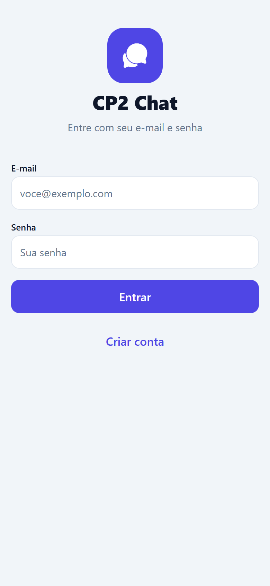 | 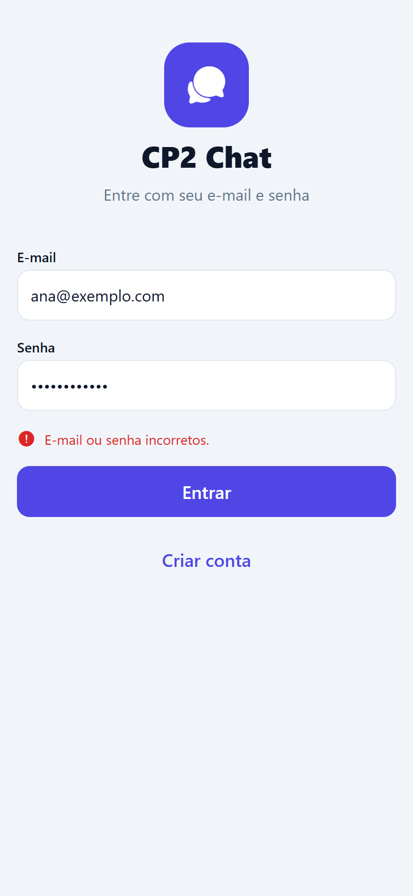 | 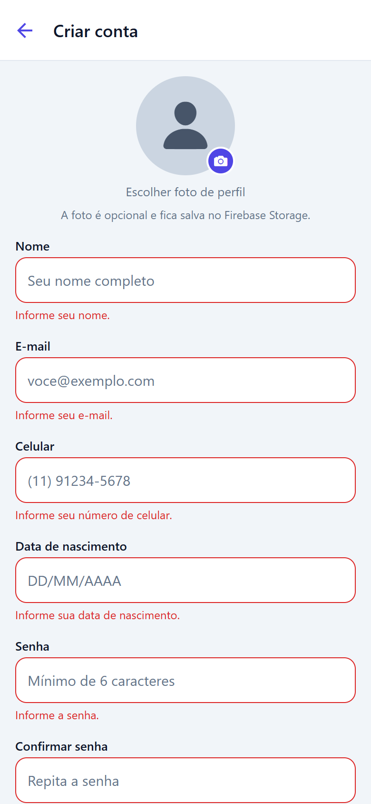 |

| Conversas | Usuários | Busca de usuários |
|---|---|---|
| 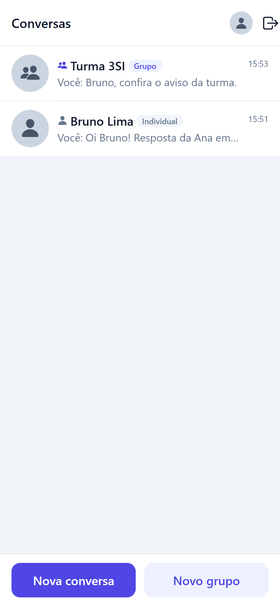 | 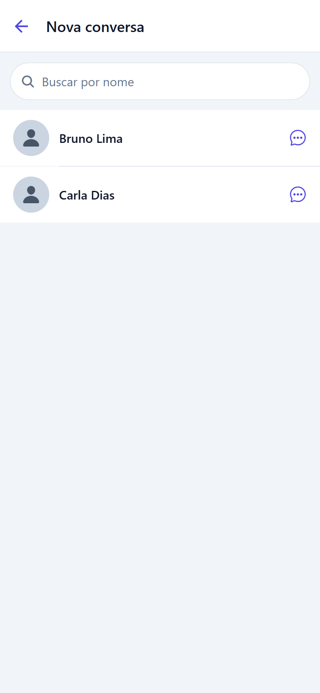 | 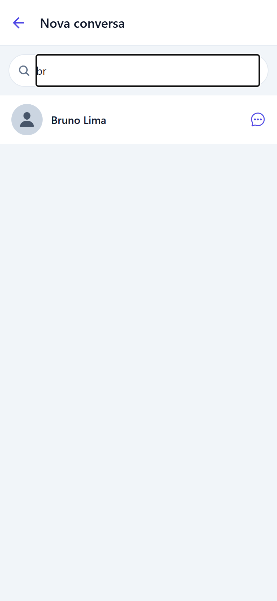 |

| Chat em grupo | Integrantes do grupo | Perfil do integrante |
|---|---|---|
| 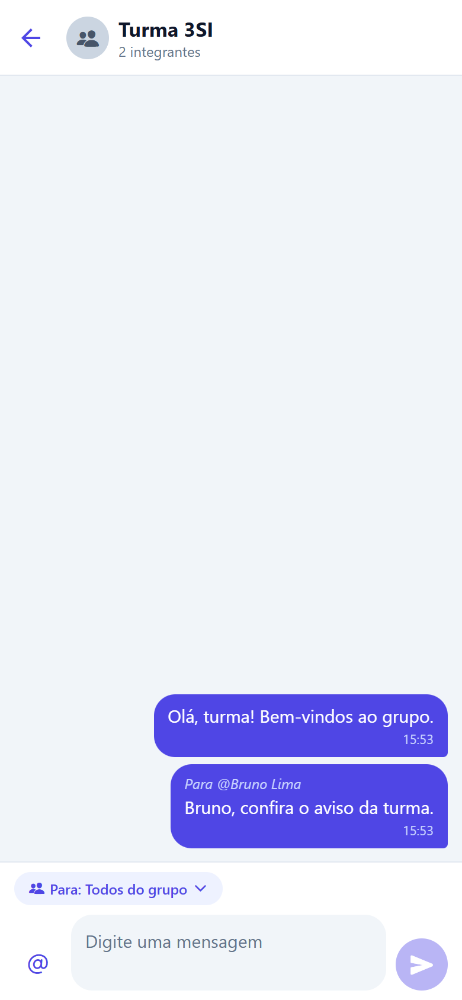 | 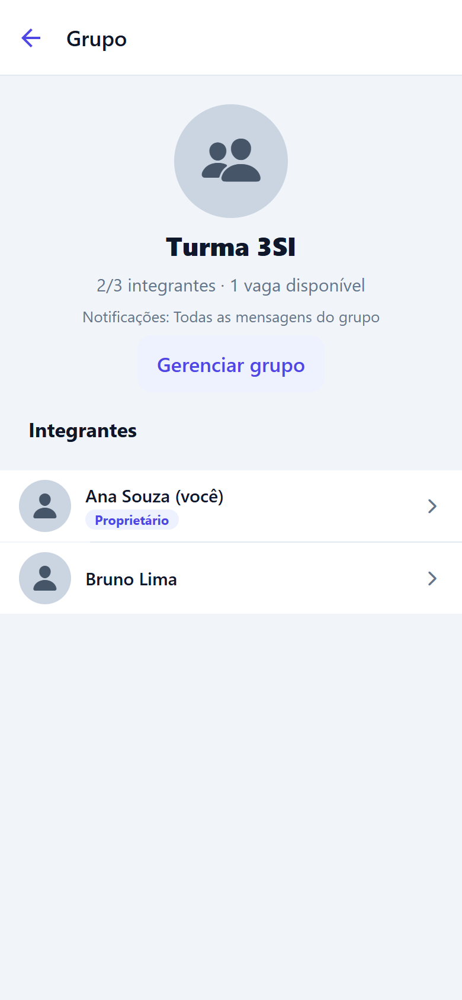 | 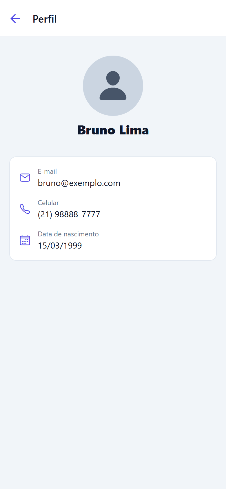 |

| Chat individual | Meu perfil | Editar grupo (limite, vagas, política) |
|---|---|---|
| 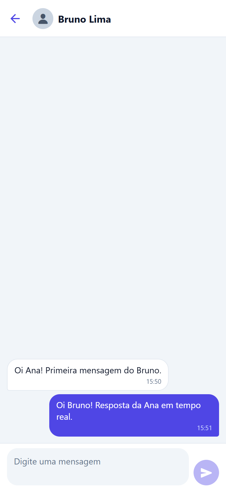 | 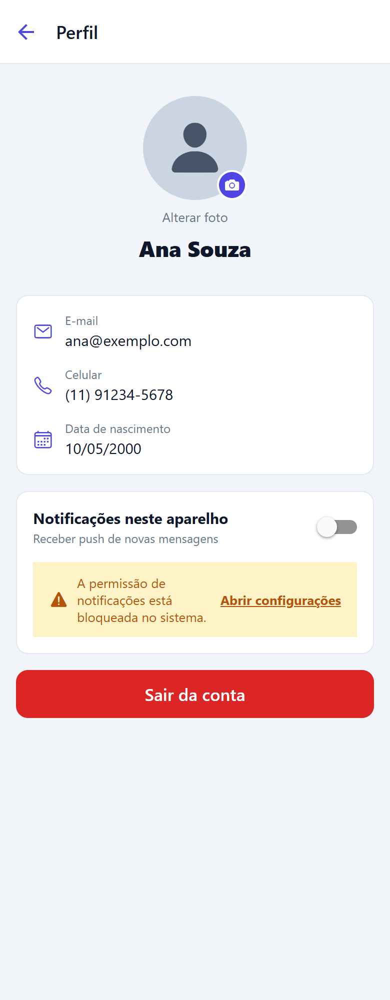 | 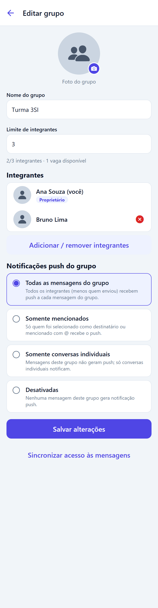 |

### Evidência de notificação recebida

> ⚠️ **Pendente (equipe):** após publicar a API e instalar o development build em um aparelho físico, envie uma mensagem
> de outro usuário com o app em segundo plano e salve a captura da notificação em
> `docs/screenshots/13-notificacao-recebida.png`. Em seguida, substitua este aviso por:
>
> ``

Roteiro de verificação: (1) usuário A e B em aparelhos diferentes; (2) A cria um grupo com B e define a política;
(3) com o app de B em segundo plano, A envia uma mensagem; (4) B recebe o push e, ao tocar, abre o grupo; (5) repita para as
quatro políticas e confirme que o remetente nunca recebe a própria notificação.

---

## 📝 Decisões de projeto e limitações

- **Dois bancos, uma API de coordenação**: Firestore guarda perfis/grupos/tokens; Realtime Database guarda as mensagens.
  Como as regras do RTDB não leem o Firestore, o acesso aos grupos é espelhado pela API (`sync-members`). Há uma pequena janela
  entre salvar o grupo e a API concluir o espelho; o app trata isso com novas tentativas automáticas nos listeners e o
  proprietário pode usar **"Sincronizar acesso às mensagens"** no formulário do grupo.
- **Dados cadastrais** ficam em `users/{uid}/private/profile` e são entregues pela API; a lista de usuários mostra apenas nome e foto.
  Conforme o enunciado, quem compartilha uma conversa individual com alguém passa a poder ver seu perfil — como qualquer usuário
  pode iniciar uma conversa, isso é uma característica do requisito.
- **Push**: Android usa FCM diretamente (Admin SDK); iOS usa o Expo Push Service (APNs). O tipo do token é guardado em
  `users/{uid}/devices/{deviceId}.tokenType` e a API roteia por ele.
- **Conectividade**: o Realtime Database mantém as mensagens enviadas offline em fila; o app mostra faixa de "sem conexão",
  falha de envio com **Reenviar** e aviso quando o push não pôde ser solicitado (a API é idempotente, então reenviar é seguro).
- As capturas desta documentação foram feitas em modo emulador; o push real **não** pôde ser exercitado fora de um dispositivo
  físico com a API publicada — a lógica de destinatários, idempotência e remoção de tokens é coberta por testes automatizados.

---

## Integrantes

- RM557768 — Léo Masago
- RM556807 — Eduardo Tomazela
- RM555235 — Luiz Henrique Silva
